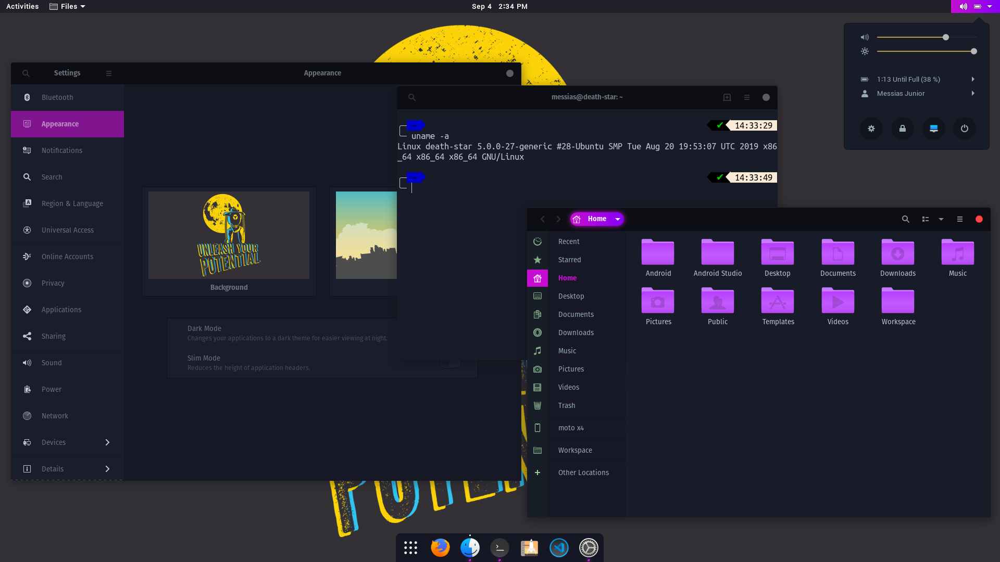
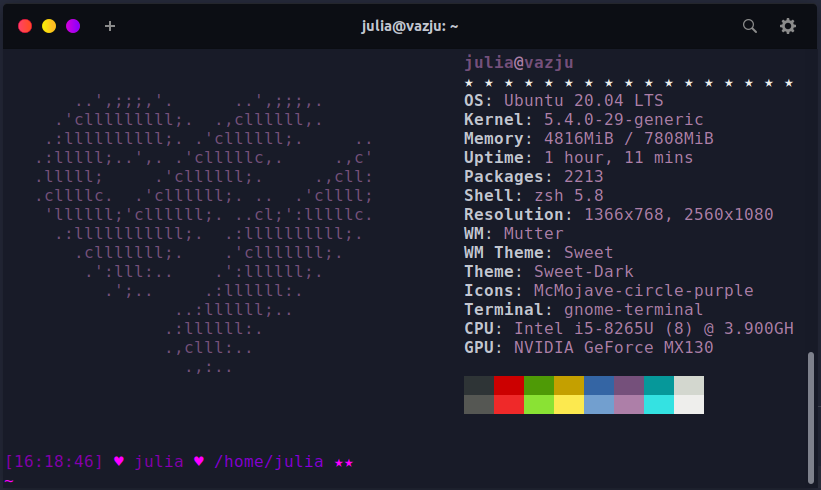

# Ubuntu Theme
1. [Instalação Ubuntu](#Instalação-ubuntu)
2. [Theme](#Theme)
3. [Terminal](#Terminal)
   1. [Neofetch](##Neofetch)
4. [Autor](#Autor)

# Instalação Ubuntu
Eu fiz um dual boot, mas utilizei esse [_tutorial_](https://www.softdownload.com.br/como-instalar-ubuntu-dual-boot-windows.html) como base para nada dar errado (ps: deu tudo certo de verdade).

# Theme
Utilizei como inspiração o theme [_Sweet LoliPOP_](https://www.gnome-look.org/p/1361215/) e fiz pequenas alterações no terminal.

> Theme: Sweet LoliPOP

- GTK Theme: Sweet Dark
- Icon theme: McMojave Circle Purple
- Extensions: Dash to Dock and User themes

# Terminal
Gosto de usar o [_zsh_](https://ohmyz.sh/), mas as alterações você também consegue fazer no bash ou em outro que você utilizar.

 
> O theme zsh que utilizei foi o [_evan_](config/evan.zsh-theme.txt)

- Instalação do zsh, [_link._](https://github.com/ohmyzsh/ohmyzsh/wiki/Installing-ZSH)
- Outros themes do zsh, [_link._](https://github.com/ohmyzsh/ohmyzsh/wiki/Themes) 
- Caso queira usar o zsh como default, [_link._](https://diolinux.com.br/2017/03/como-alterar-o-terminal-padrao-bash-zsh.html)
- Emoticons, [_link._](https://meucantinhodasideias.wordpress.com/category/emoticons/)
- Este tutorial me ajudou totalmente a entender como funciona a customização, caso queira fazer do seu jeitinho [_segue link._](https://dev.to/yujinyuz/custom-colors-in-oh-my-zsh-themes-4h13)

### Neofetch
- Eu criei meu icon baseado no [_logo_](config/logo-ascii.txt) da comunidade [_He4rt Devs_](https://twitter.com/He4rtDevs), mas você pode fazer com uma imagem a sua escolha.
- Para alterar seu neofetch primeiro você tem que:
    - Pegar a imagem e converter para formato [_ASCII_](https://www.topster.pt/gerador-ascii/) (exitem outros formatos);
    - Logo após, colar no arquivo [_`config.config`_](config/config.config.txt) dentro do diretório do neofetch na área de `Image Source`. (não sei se colocar direto assim é gambiarra, mas funciona kkkkkkkk).
- Cores utilizadas estão no arquivo [_`config.config`_](config/config.config.txt), nos tópicos: 
    - _`# Text Colors`_ 
    - _`# Ascii Colors`_

# Contribua
#### Se quiser compartilhar alguma customização insira nas ``ISSUES``.

# Autor
- #### Júlia Vaz - Developer - [_Twitter_](http://www.twitter.com.br/jujuvazzz)

Made with 💜
